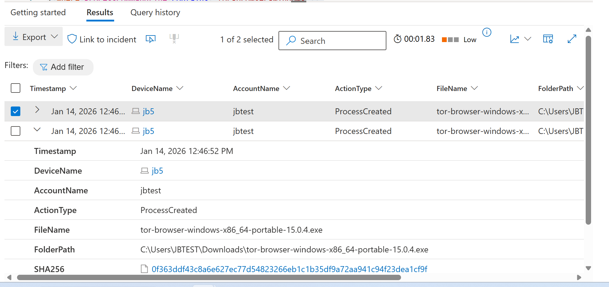
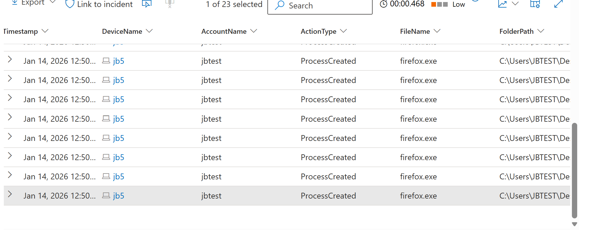

# Official [Cyber Range](http://joshmadakor.tech/cyber-range) Project


# Threat Hunt Report: Unauthorized TOR Usage
- [Scenario Creation](https://github.com/junistaurelien/Threat-Hunting-Scenario-tor/blob/main/threat-hunting-scenario-tor-event-creation.md)

Scope note:** This report includes only Tor Browser–related** file, process, and network activity identified during the threat hunt on endpoint **JB5** 

## Platforms and Languages Leveraged
- Windows 10 Virtual Machines (Microsoft Azure)
- EDR Platform: Microsoft Defender for Endpoint
- Kusto Query Language (KQL)
- Tor Browser

#) Incident Overview

**Incident Type:** Unauthorized application usage (Tor Browser)  
**Date Observed:** 2026-01-14T17:36:05.51276Z 
**Endpoint:** JB5  
**Primary User Observed:** JBtest

---
##  Scenario (threat-hunting-scenario-tor-event-creation.md) 

Management suspects that some employees may be using TOR browsers to bypass network security controls because recent network logs show unusual encrypted traffic patterns and connections to known TOR entry nodes. Additionally, there have been anonymous reports of employees discussing ways to access restricted sites during work hours. The goal is to detect any TOR usage and analyze related security incidents to mitigate potential risks. If any use of TOR is found, notify management.

#   Objective

1. Detect Tor Browser installation artifacts and execution  
2. Identify impacted endpoint and user account(s)  
3. Confirm Tor component activity (`tor.exe` / Tor Browser `firefox.exe`)  
4. Validate Tor-related network connections  
5. Produce a chronological, Tor-only timeline for reporting_


### High-Level TOR-Related IoC Discovery Plan

- **Check `DeviceFileEvents`** for any `tor(.exe)` or `firefox(.exe)` file events.
- **Check `DeviceProcessEvents`** for any signs of installation or usage.
- **Check `DeviceNetworkEvents`** for any signs of outgoing connections over known TOR ports.

---

## Steps Taken

### 1. Searched the `DeviceFileEvents` Table

Searched for any file that had the string "tor" in it and discovered what looks like the user "employee" downloaded a TOR installer, did something that resulted in many TOR-related files being copied to the desktop, and the creation of a file called `tor-shopping-list.txt` on the desktop at `2026-01-14T17:57:55.4546981Z`. These events began at `2026-01-14T17:36:05.51276Z`.

**Query used to locate events:**

```kql
DeviceFileEvents
| where Timestamp >= ago(4d)
| where DeviceName =~ "jb5"
| where InitiatingProcessAccountName =~ "jbtest"
| where FileName has "tor"
| order by Timestamp desc
| project Timestamp, DeviceName, ActionType, FileName, FolderPath, SHA256, Account = InitiatingProcessAccountName
  

```
<<p align="center">
  
</p>

---

### 2. Searched the `DeviceProcessEvents` Table

Searched for any `ProcessCommandLine` that contained the string "tor-browser-windows-x86_64-portable-15.0.1.exe". Based on the logs returned, at `2026-01-14T17:46:52.1979684Z`, an employee on the "JB5" device ran the file `tor-browser-windows-x86_64-portable-15.0.1.exe` from their Downloads folder, using a command that triggered a silent installation.

**Query used to locate event:**

```kql

DeviceProcessEvents  
| where DeviceName == "jb5"  
| where ProcessCommandLine contains "tor-browser-windows"  
| project Timestamp, DeviceName, AccountName, ActionType, FileName, FolderPath, SHA256, ProcessCommandLine
```
<p align="center">
  
</p>


---

### 3. Searched the `DeviceProcessEvents` Table for TOR Browser Execution

Searched for any indication that user "employee" actually opened the TOR browser. There was evidence that they did open it at `2026-01-14T17:50:01.6781576Z`. There were several other instances of `firefox.exe` (TOR) as well as `tor.exe` spawned afterwards.

**Query used to locate events:**

```kql
DeviceProcessEvents  
| where DeviceName == "jb5"  
| where FileName has_any ("tor.exe", "firefox.exe", "tor-browser.exe")  
| project Timestamp, DeviceName, AccountName, ActionType, FileName, FolderPath, SHA256, ProcessCommandLine  
| order by Timestamp desc
```
<p align="center">
  
</p>

---

### 4. Searched the `DeviceNetworkEvents` Table for TOR Network Connections

Searched for any indication the TOR browser was used to establish a connection using any of the known TOR ports. At `2026-01-14T17:50:41.6742689Z`, an employee on the "JB5" device successfully established a connection to the remote IP address `176.198.159.33` on port `9001`. The connection was initiated by the process `tor.exe`, located in the folder `c:\users\employee\desktop\tor browser\browser\torbrowser\tor\tor.exe`. There were a couple of other connections to sites over port `443`.

**Query used to locate events:**

```kql
DeviceNetworkEvents  
| where DeviceName == "jb5"  
| where InitiatingProcessAccountName != "system"  
| where InitiatingProcessFileName in ("tor.exe", "firefox.exe")  
| where RemotePort in ("9001", "9030", "9040", "9050", "9051", "9150", "80", "443")  
| project Timestamp, DeviceName, InitiatingProcessAccountName, ActionType, RemoteIP, RemotePort, RemoteUrl, InitiatingProcessFileName, InitiatingProcessFolderPath  
| order by Timestamp desc

```
<p align="center">
  
</p>

---

## Chronological Event Timeline 

### 1. File Download - TOR Installer

- **Timestamp:** `2026-01-14T17:50:41.6742689Z`
- **Event:** The user "JBTEST" downloaded a file named `tor-browser-windows-x86_64-portable-15.0.1.exe` to the Downloads folder.
- **Action:** File download detected.
- **File Path:** `C:\Users\employee\Downloads\tor-browser-windows-x86_64-portable-15.0.1.exe`

### 2. Process Execution - TOR Browser Installation

- **Timestamp:** `2026-01-14T17:50:41.6742689Z`
- **Event:** The user "JBTEST" executed the file `tor-browser-windows-x86_64-portable-15.0.1.exe` in silent mode, initiating a background installation of the TOR Browser.
- **Action:** Process creation detected.
- **Command:** `tor-browser-windows-x86_64-portable-15.0.1.exe /S`
- **File Path:** `C:\Users\employee\Downloads\tor-browser-windows-x86_64-portable-15.0.1.exe`

### 3. Process Execution - TOR Browser Launch

- **Timestamp:** `2024-11-08T22:17:21.6357935Z`
- **Event:** User "employee" opened the TOR browser. Subsequent processes associated with TOR browser, such as `firefox.exe` and `tor.exe`, were also created, indicating that the browser launched successfully.
- **Action:** Process creation of TOR browser-related executables detected.
- **File Path:** `C:\Users\employee\Desktop\Tor Browser\Browser\TorBrowser\Tor\tor.exe`

### 4. Network Connection - TOR Network

- **Timestamp:** `2024-11-08T22:18:01.1246358Z`
- **Event:** A network connection to IP `176.198.159.33` on port `9001` by user "employee" was established using `tor.exe`, confirming TOR browser network activity.
- **Action:** Connection success.
- **Process:** `tor.exe`
- **File Path:** `c:\users\employee\desktop\tor browser\browser\torbrowser\tor\tor.exe`

### 5. Additional Network Connections - TOR Browser Activity

- **Timestamps:**
  - `2024-11-08T22:18:08Z` - Connected to `194.143.137.213` on port `443`.
  - `2024-11-08T22:18:16Z` - Local connection to `127.0.0.1` on port `9150`.
- **Event:** Additional TOR network connections were established, indicating ongoing activity by user "employee" through the TOR browser.
- **Action:** Multiple successful connections detected.

### 6. File Creation - TOR Shopping List

- **Timestamp:** `2026-01-14T17:57:55.4546981Z`
- **Event:** The user "JBTEST" created a file named `tor-shopping-list.txt` on the desktop, potentially indicating a list or notes related to their TOR browser activities.
- **Action:** File creation detected.
- **File Path:** `C:\Users\employee\Desktop\tor-shopping-list.txt`
---

---
#Key Findings (TOR-ONLY) 
Tor installer was executed silently (/S) by JBtest from Downloads.

Tor Browser runtime executed from Tor Browser paths (firefox.exe) and started the Tor service (tor.exe).

Network connections initiated by tor.exe to multiple external IPs were observed during the usage window.

Loopback connections (127.0.0.1) initiated by Tor Browser firefox.exe were observed, consistent with local proxy behavior.

A Tor-named shortcut (tor-shopping-list.lnk) appeared in Recent Items following the observed activity.

Network Observables (Tor component initiated)
---
**File / Process IoCs**

tor-browser-windows-x86_64-portable-15.0.4.exe

SHA-256: 0f363ddf43c8a6e627ec77d54823266eb1c1b35df9a72aa941c94f23dea1cf9f

Path: C:\Users\JBTEST\Downloads\...

Command Line: "tor-browser-windows-x86_64-portable-15.0.4.exe" /S

Tor Browser runtime:

C:\Users\JBTEST\Desktop\Tor Browser\Browser\firefox.exe

C:\Users\JBTEST\Desktop\Tor Browser\Browser\TorBrowser\Tor\tor.exe
**Remote IPs:**

94.143.137.213

38.102.84.24

193.105.134.16

101.182.13.197 (failed)

URLs observed:

https://www.24c5725m75jzjsfghsbqz.com

https://www.5uzkw4r5o667.com
## Summary of events 

On 1/14/26, user JBtest on endpoint JB5 executed the Tor Browser portable installer twice in silent mode, created Tor Browser desktop shortcuts, then launched Tor Browser (firefox.exe) and started the Tor service (tor.exe). Tor component network activity was observed shortly afterward, confirming operational Tor usage. A Tor-named Recent Items shortcut (tor-shopping-list.lnk) was also created later in the same timeframe.

---

## Response Taken

TOR usage was confirmed on endpoint JB5 by user JBtest. The device was isolated and the user’s direct manager was notified.

Recommended Follow-Up (Tor-focused)

Validate policy requirements and whether Tor usage was authorized.

Remove Tor Browser artifacts and verify no persistence remains.

Expand hunt to other endpoints for Tor installer and runtime indicators.

Consider alerting on:

Tor installer execution (tor-browser-windows*portable*.exe) and silent flags (/S)

Tor runtime (*\Tor Browser\Browser\firefox.exe and *\TorBrowser\Tor\tor.exe)

Tor component network connections (initiated by tor.exe)

---
